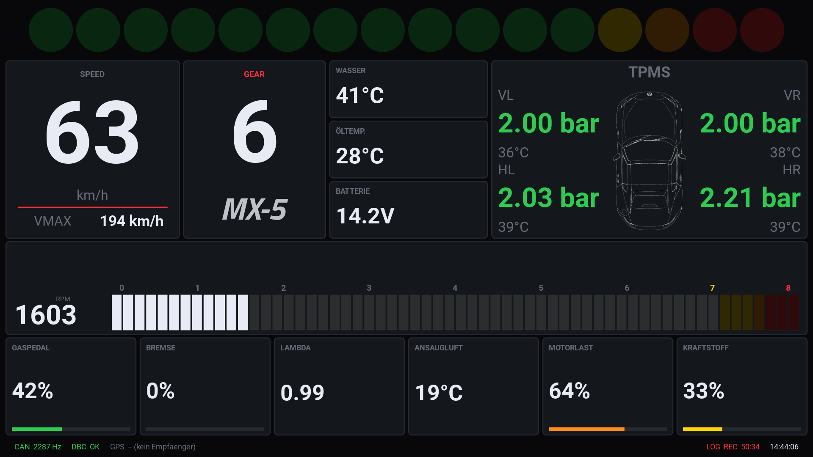

# Pi-Laufzeitstatus: was läuft gerade auf dem Auto-Pi

Momentaufnahme des tatsächlichen Zustands auf dem Raspberry Pi im Auto (nicht
zu verwechseln mit [`../../scripts/pi-config/SETUP.md`](../../scripts/pi-config/SETUP.md),
das die Ersteinrichtung/Reproduzierbarkeit beschreibt). **In-place aktualisieren
bei jedem Deploy/Neustart auf dem Pi** — sonst veraltet das schnell, weil hier
kein Git läuft (siehe unten).

**Stand: 2026-09-26, 11:40 Uhr** (Deploy der Offline-Ausbeute; per SSH auf `pi@192.168.0.247` geprüft,
Hostname `car`, passwordless SSH+sudo — siehe `mx5_can_bus_logging`-Memory).

## Kein Git auf dem Pi

`/home/pi/canlogs` ist kein Git-Repo — Deploys laufen bisher **manuell per
`scp`** einzelner Dateien. Das heißt: der Ist-Zustand auf dem Pi lässt sich
nicht aus `git log` ablesen, sondern nur durch Abgleich (mtime/md5sum) gegen
das lokale Repo. Deshalb dieser Abschnitt.

**md5sum-Abgleich der zentralen Skripte (2026-09-26, 11:40, nach Deploy):** alle unten genannten Dateien identisch mit dem Repo (Branch `can-offline-ausbeute`; DBC um 11:52 auf den Stand nach dem Merge mit `main` nachgezogen, `can_backend.py` erneut neu gestartet). Vorherige Pi-Stände gesichert in `/home/pi/canlogs/backup-2026-09-26/`.

| Datei | Pi = lokales Repo? | Bemerkung |
|---|---|---|
| `dash_gui.py` | ✅ identisch | inkl. blau blinkender Shiftlights bei ECU-Limiter-Eingriff (siehe `status/can-bus.md`) |
| `test_dash_gui.py` | ✅ identisch | |
| `can_backend.py` | ✅ identisch | unverändert seit 16.09. (Kivy-Neubau) |
| `tpms_poller.py` | ✅ identisch (deployt 26.09.) | neu: PID 0x3C (Kat-Temperatur), 0x34 (gemessenes Lambda), 0x2F (Tankfüllstand) in der langsamen 10-s-Gruppe - Fahrzeugtest C9 aus `status/can-open-fields.md`. Greift ab der nächsten Logging-Session (Poller wird von `session_logger.py` je Fahrt neu gestartet). |
| `session_logger.py` | ✅ identisch (deployt 26.09.) | Kommentar-Drift vom 18.09. mitgenommen (nur Pfadangaben). `status_gui.py` und `uds_did_sweep.py` ebenso angeglichen. |
| `MX5ND_6thGenMazda_HSCAN_extended.dbc` | ✅ identisch (deployt 26.09.) | Offline-Ausbeute (TCS, Rückwärtsgang, Spannungen, i-stop, Steigung, `AmbientTemp`-Korrektur …). Auf dem Pi mit cantools 44.0 strikt geladen (151 Botschaften). Das Dash zeigt die neuen Signale noch nicht an; die Testmodus-Zeile "Rückwärtsgang" nutzt weiterhin das tote `Reverse_Flag_maybe` statt `ReverseGear`. |

**Vorgehen für den Abgleich (bei Bedarf wiederholen):**
```bash
for f in dash_gui.py can_backend.py session_logger.py tpms_poller.py; do
  diff <(md5sum scripts/$f | cut -d' ' -f1) \
       <(ssh pi@192.168.0.247 "md5sum /home/pi/canlogs/$f | cut -d' ' -f1") \
       && echo "$f OK" || echo "$f WEICHT AB"
done
```

## Laufende Prozesse

- **`can_backend.py`** (26.09.: nach dem Deploy per SSH neu gestartet, PID 2440, gleicher Aufruf wie im Autostart, Ausgabe nach `/tmp/can_backend_restart.log` - geht beim nächsten Reboot wieder über den Autostart; vorher PID 1056, läuft seit Boot 13:37 Uhr) — Decode-Daemon,
  publiziert UDP-Snapshot auf Port 51234. Läuft immer, unabhängig von `can0`
  (zeigt bei fehlendem Bus nur `self.error` im Snapshot).
- **`dash_gui.py`** (PID 2198, seit 13:55 Uhr — **gerade neu gestartet** für
  das Shiftlight-Feature) — Kivy-Frontend, liest den UDP-Snapshot.
- Beide über `/home/pi/canlogs/../pi-config/autostart` beim Desktop-Login
  gestartet (**nicht** über systemd).

**Screenshot vom laufenden Dashboard (2026-09-20, 14:44 Uhr, per `grim` über
Wayland/labwc):**



## `can-logger.service` (systemd, KeyState-getriggert)

- **Aktuell `inactive`** — erwartet, kein Fehler: der Service ist per
  `BindsTo=sys-subsystem-net-devices-can0.device` an das `can0`-Interface
  gebunden (`/etc/udev/rules.d/90-can-logger.rules`), das gerade nicht
  existiert (Adapter nicht dran / Zündung aus). Startet automatisch, sobald
  `can0` auftaucht.
- Wenn aktiv, startet `session_logger.py` **zwei Subprozesse**:
  1. `candump -l can0` (Rohlog)
  2. `tpms_poller.py --channel can0 --interval 120` — **das ist der Prozess,
     der die ETC_ACT/Lambda/KnockRetard-Fast-Polls (PID 0x11/0x44, DID
     0x03EC) tatsächlich auf den Bus sendet.** `can_backend.py` selbst sendet
     nichts, es hört die Antworten nur passiv mit (0x7E8) — ohne laufenden
     `tpms_poller.py` gäbe es kein ETC_ACT/Lambda/KnockRetard im Dash oder im
     Log. Läuft `--no-oil` NICHT (Flag wird von `session_logger.py` nicht
     gesetzt) → Fast-Gruppe (`poll_obd1_fast`, `poll_knock_fast`) läuft
     ungegatet jede Schleifenrunde.
  3. TPMS-Abfrage selbst (langsam, alle 120s) läuft im selben Prozess mit.
- `enabled` (startet automatisch bei jedem Boot bzw. `can0`-Auftauchen).

## Sonstiges

- **NTP:** `NTPSynchronized=yes` (Stand jetzt). Pi hat keine RTC — nach einem
  Boot ohne Netz bleibt die Uhr falsch, ohne erkennbaren Sprung im Log (vierter
  dokumentierter Fall siehe `docs/logs/can-bus-status.md`, "Viertes
  No-RTC-Vorkommnis"). Bei jedem CAN-only-Log ohne GPS-Zeitanker: Datum mit
  Vorsicht behandeln.
- **Pi-Uptime bei dieser Prüfung:** 31 Minuten (kürzlich gebootet, nicht durch
  den Shiftlight-Deploy verursacht — nur `dash_gui.py` wurde einzeln
  neugestartet, nicht der ganze Pi).
- DBC auf dem Pi (`MX5ND_6thGenMazda_HSCAN_extended.dbc`) ist byteidentisch
  mit dem lokalen Repo-Stand (zuletzt 15.09., ABS-Indikator).
